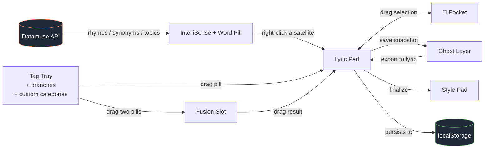

<div align="center">

```
╭─────────────────────────────────────────────────────────────╮
│                                                             │
│   ██╗  ██╗   ██╗██████╗ ██╗ ██████╗ █████╗ ██╗              │
│   ██║  ╚██╗ ██╔╝██╔══██╗██║██╔════╝██╔══██╗██║              │
│   ██║   ╚████╔╝ ██████╔╝██║██║     ███████║██║              │
│   ██║    ╚██╔╝  ██╔══██╗██║██║     ██╔══██║██║              │
│   ███████╗██║   ██║  ██║██║╚██████╗██║  ██║███████╗         │
│   ╚══════╝╚═╝   ╚═╝  ╚═╝╚═╝ ╚═════╝╚═╝  ╚═╝╚══════╝         │
│                                                             │
│              C  A  D     S  T  U  D  I  O                   │
│                                                             │
│        a workbench for songwriters who think in pieces      │
│                                                             │
╰─────────────────────────────────────────────────────────────╯
```

[](https://nextjs.org)
[](https://react.dev)
[](https://www.typescriptlang.org)
[](https://tailwindcss.com)
[](#)
[](#privacy--your-data)

</div>

---

LyricalCAD treats a song the way a CAD app treats a model: **drop in pieces, snap them together, branch a section, render a ghost of the last take, and keep iterating.** It is a single-page workspace built around six ideas — a *tag tray* for the lines you might use, a *fusion slot* for combining them, a *pocket* for things you cut but might want back, a *ghost mode* for layering revisions over the original, a *quest* loop for momentum, and a *style pad* for the finished take.

It runs entirely in your browser. No accounts, no cloud, no telemetry — your work lives in `localStorage`.

---

## Table of Contents

- [Quick start](#quick-start)
- [The 60-second tour](#the-60-second-tour)
- [How the workspace fits together](#how-the-workspace-fits-together)
- [Usage guide](#usage-guide)
- [Keyboard & gesture cheatsheet](#keyboard--gesture-cheatsheet)
- [Privacy & your data](#privacy--your-data)
- [Tech stack](#tech-stack)
- [Developing](#developing)
- [Roadmap](#roadmap)
- [Reporting bugs](#reporting-bugs)

---

## Quick start

> **TL;DR — clone, double-click a launcher, write a song.**

### Option 1 — One-click (recommended for testers)

1. Install **[Node.js LTS](https://nodejs.org/)** (one time, takes ~2 minutes).
2. Download this repo as a ZIP (green **Code** button → *Download ZIP*) and unzip.
3. Double-click the launcher for your OS:

   | OS              | File          |
   |-----------------|---------------|
   | Windows         | `launch.bat`  |
   | macOS / Linux   | `launch.sh`   |

4. The first run installs dependencies and compiles a production bundle (≈1 minute).
   Future launches start in seconds.
5. Your browser opens to **<http://localhost:3001>** automatically.

> macOS first-time setup: `chmod +x launch.sh` if Finder won't run it.

### Option 2 — Developer flow

```bash
git clone https://github.com/MiniDraco/lyrical-cad-studio-ai-song-writing.git
cd lyrical-cad-studio-ai-song-writing
npm install
npm run dev          # hot-reload dev server on :3001
# or
npm run go           # production build + start on :3001
```

---

## The 60-second tour

When the app opens you see four zones:

```
┌──────────────────────────────────────────────────────────────────┐
│  TOPBAR     dock · style · ghost · pocket · help · settings · ⌖   │
├──────────┬──────────────────────────────┬────────────────────────┤
│          │                              │                        │
│  TAG     │          LYRIC PAD           │      STYLE PAD         │
│  TRAY    │                              │  (the polished take)   │
│          │   ← type here, the gutter →  │                        │
│  + branches │  shows syllable counts    │                        │
│  + custom    │  per line                │                        │
│            │                            │                        │
├──────────┴──────────────────────────────┴────────────────────────┤
│  FOOTER   🎯 quest · 🌐 creativity · 🎲 random · counts          │
└──────────────────────────────────────────────────────────────────┘
```

- **Type freely** in the lyric pad. Syllable counts paint themselves in colored boxes as you go.
- **Long-press a word (~½s)** to open the **Word Pill** — an orbit of related words pulled from Datamuse.
- **Ctrl + Right-click a word** to open the **Net Tap** dropdown (rhymes, synonyms, fills-the-blank, sound-alikes, and more).
- **Drag a Pocket selection** to the 👜 button up top to stash it for later.
- **Toggle Ghost Mode** (Ctrl+G) to overlay your previous version under the current one — like onion-skinning in animation.

---

## How the workspace fits together



Every box above is a real surface in the app. Nothing leaves your machine except the Datamuse word lookups (and only when you actually invoke them).

---

## Usage guide

<details>
<summary><b>🏷️ Tag Tray — your library of reusable lines</b></summary>

The left dock holds six built-in categories (Hooks, Imagery, Verbs, Phrases, Slang, Misc), plus any **custom categories** you create with their own icon and color, plus **Branches** — saved sets of pills you can drop as a block.

- **Click a pill** to insert it at the caret.
- **Drag a pill** to a specific spot in the pad.
- **Drag two pills into the Fusion Slot** to combine them — the slot purges with the ✕ button and the result is itself draggable.
- **Drop a Branch on the Style Pad** to expand all its pills as a block.
- **Bulk Edit / Import / Export** lives in Settings → Library.

Custom categories support an **icon picker** so your tray stays scannable.

</details>

<details>
<summary><b>👻 Ghost Mode — onion-skinning for lyrics</b></summary>

Press **Ctrl+G** (or click the ghost icon). The current pad's text is captured as a translucent layer beneath your live edits. Rewrite the verse — the original sits there as a reference until you toggle ghost back off or export it to a fresh pad.

- Each pad keeps its **own** ghost state (switch tabs, ghosts come with).
- Ghost color and opacity live in **Settings → Ghost**.
- The ghost renders as live HTML (not a screenshot), so syllable boxes and word pills line up exactly with the current text.

</details>

<details>
<summary><b>🧠 IntelliSense & the Word Pill</b></summary>

Two lookup surfaces, both powered by [Datamuse](https://www.datamuse.com/api/):

| Trigger                       | What it does                                                   |
|-------------------------------|----------------------------------------------------------------|
| **Type past 3 letters**       | Inline IntelliSense suggests completions; **Tab** to commit.   |
| **Long-press a word (~½s)**   | Opens **Word Pill** — center word with related words orbiting. |
| **Ctrl + Right-click a word** | Opens **Net Tap** — pick a mode (rhyme, synonym, antonym…).    |

Inside the Word Pill: **click** a satellite to promote it to center, **right-click** to insert it into the pad at the caret.

</details>

<details>
<summary><b>👜 Pocket — clipboard with a memory</b></summary>

The Pocket is for things you cut but aren't sure about. Drag any selection from the pad to the 👜 in the topbar — hover-to-open works, you don't have to click first. Pocket items are draggable back into any pad.

</details>

<details>
<summary><b>🎯 Quest — momentum loop</b></summary>

Bottom-left ribbon. Each quest is a small writing prompt worth 10 points. Skip, complete, or refresh. Used for warming up or breaking out of a stuck verse.

</details>

<details>
<summary><b>🌐 Creativity & 🎲 Random</b></summary>

Two helpers in the footer:

- **Creativity Tray** — a panel of embedded inspiration sources (configurable iframes).
- **Random Generator** — your own seeded list of stems, prompts, or palette words. Configure in the gear icon.

</details>

<details>
<summary><b>🎨 Word Probes & syllable coloring</b></summary>

In Settings → Probes, add **topic words**. Any word in your pad that semantically matches gets a subtle highlight, so you can see your imagery clusters at a glance. Probes fetch on-the-fly via Datamuse.

Syllable counts get colored boxes (1 syllable, 2, 3, …). The palette is fully customizable in **Settings → Syllable Colors** — pick any hex per count, or use the `--syl-bg-alpha` slider to fade them.

</details>

<details>
<summary><b>⚙️ Settings — the kitchen sink, organized</b></summary>

Collapsible sections, top toolbar with **Import / Export / Master Reset**:

- **General** — main text color, editor font (12 curated + custom), bold/italic, size
- **Chrome** — canvas background, sidebar tints, button shape grid, UI scale
- **Pills** — pill shape selector, per-category colors (incl. discovered)
- **Ghost** — color, opacity
- **Syllable Colors** — per-count color & alpha
- **Library** — tag categories: bulk edit, import, export
- **Probes** — topic words for highlighting
- **Random** — seed list for the dice
- **Creativity** — iframe URLs
- **⚠ Master Reset** — wipes everything to defaults (double-confirm)

</details>

---

## Keyboard & gesture cheatsheet

| Keys / gesture                            | What it does                                                  |
|-------------------------------------------|---------------------------------------------------------------|
| `Ctrl` + `G`                              | Toggle Ghost Mode                                             |
| `Ctrl` + `S`                              | Save active pad as `.txt`                                     |
| `Ctrl` + `,`                              | Open Settings                                                 |
| `Ctrl` + `B`                              | Open Pocket                                                   |
| `Ctrl` + `Shift` + `N`                    | New pad (tab)                                                 |
| `Ctrl` + `1`…`9`                          | Jump to pad N                                                 |
| `Ctrl` + `'`                              | Cycle bracket type (`[ → { → ( → < → ø`)                      |
| `Ctrl` + `?`                              | Open the in-app cheatsheet                                    |
| `Esc`                                     | Close any open popover / modal                                |
| `Tab` (in IntelliSense)                   | Commit the highlighted suggestion                             |
| Right-click word                          | Native browser menu (spellcheck, etc.)                        |
| `Ctrl` + Right-click word                 | Open Net Tap dropdown for that word                           |
| Long-press word (~½s)                     | Open the Word Pill                                            |
| Right-click a satellite pill              | Insert that pill at the caret                                 |
| Click a satellite pill                    | Promote it to the center of the Word Pill                     |
| Drag selection → 👜 (hover)                | Save into Pocket                                              |
| Drag from Pocket → Pad                    | Insert at drop point                                          |
| Drop **Branch** on **Style** pad          | Expand all its tags as a block                                |
| Double-click pad tab                      | Rename that pad                                               |

> On macOS, `⌘` works in place of `Ctrl`.

---

## Privacy & your data

- **Everything you write lives in your browser's `localStorage`.** Your pads, tags, branches, pocket items, settings, ghosts, and quest progress never leave your machine.
- The **only** outbound traffic is to [Datamuse](https://www.datamuse.com/api/) for IntelliSense / Word Pill / Word Probes — and only when you actually trigger a lookup. Datamuse receives the single word being looked up; no identifiers, no pad contents.
- No accounts. No cookies that persist beyond the tab. No telemetry. The Next.js telemetry beacon is disabled in `package.json` (`NEXT_TELEMETRY_DISABLED=1`).
- **Backup tip:** `Settings → Library → Export` writes your full library to a JSON file. Pads can be saved individually with `Ctrl+S`.

### About the `npm install` audit warnings

When you run `npm install` (or the launcher's first-run setup), npm will report **2 vulnerabilities** in transitive dependencies of Next.js. They look scary. Here's the honest read:

| Advisory                                 | What it actually requires to be exploited        | Affects this app? |
|------------------------------------------|--------------------------------------------------|:-----------------:|
| Next.js Image Optimizer DoS / cache      | Use of `next/image` with remote URLs             | ❌ not used        |
| Next.js RSC HTTP deserialization DoS     | React Server Components on a public server       | ❌ pure client SPA |
| Next.js Server Component DoS             | RSC streaming on a public server                 | ❌ pure client SPA |
| Next.js HTTP request smuggling           | `next.config.js` rewrites                        | ❌ no rewrites     |
| postcss `</style>` XSS                   | Feeding user input through `postcss.stringify`   | ❌ build-time only |

LyricalCAD runs entirely client-side on **your localhost**, with no `next/image`, no rewrites, and no Server Component streaming. None of these CVEs have a viable attack surface in this app. The fix path npm offers is a major Next.js bump that's deferred to a future polish pass; nothing about the warning blocks safe local use.

If you'd rather not see the warnings: `npm install --no-audit`.

---

## Tech stack

- **[Next.js 14](https://nextjs.org)** (App Router) + React 18
- **TypeScript 5**, strict
- **[Zustand](https://github.com/pmndrs/zustand)** with `persist` middleware → `localStorage`
- **Tailwind CSS 3.4** + CSS custom properties for runtime theming
- **[Datamuse API](https://www.datamuse.com/api/)** for word lookups (no key required)

Everything renders client-side. No backend, no API routes, no database.

---

## Developing

```bash
npm run dev            # next dev on :3001 (hot reload)
npm run dev:plain      # next dev on :3000 (no port pin)
npm run build          # production build
npm run start          # serve the production build on :3001
npm run go             # build + start in one shot
npm run lint           # next lint
```

**Project layout:**

```
src/
├── app/                 # Next.js App Router entry (layout, page, global CSS)
├── components/
│   ├── editor/          # LyricPad, StylePad, IntelliSense, WordPill, PadTabs, PadIO
│   ├── dock/            # AlchemySidebar, TagTray, Pocket, CreativityTray, RandomGen, StyleStudio
│   ├── tags/            # Pill, FusionSlot, BulkEditModal
│   ├── gutter/          # SyllableGutter
│   └── layout/          # StudioLayout, SettingsModal, HelpModal, QuestModal, IconPicker
├── lib/                 # caret, colors, datamuse, libraryIO, probeScanner, syllables, tagParser
├── store/useStudio.ts   # Zustand store (single source of truth, persisted)
└── types/index.ts
```

---

## Roadmap

This is a v1 friend-test build. The current focus is **stability of the core loop**. Things that are intentionally *not* in scope right now:

- Cloud sync / multi-device
- Collaboration / multiplayer pads
- Built-in audio recording
- Plugin / extension API

If a tester request points at any of those, the answer is "noted, not yet."

What *is* on deck (rough order):

- Pad templates (verse / chorus / bridge starters)
- Better mobile gestures (the layout reflows but touch interactions need work)
- Smarter word-probe matching (semantic clusters, not just direct matches)
- Optional rhyme-density gutter

---

## Reporting bugs

Until there's an issue tracker set up, just send a message with:

- **What you clicked / typed**
- **What you expected**
- **What happened**
- **Browser + OS**
- A **screenshot** if at all possible

The single most useful debug step: **Settings → Export Library** before reporting, so the state can be reproduced.

---

<div align="center">

*Built for the kind of writer who keeps thirty half-finished pads open at once.*

</div>
